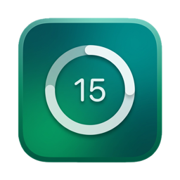
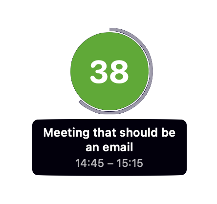
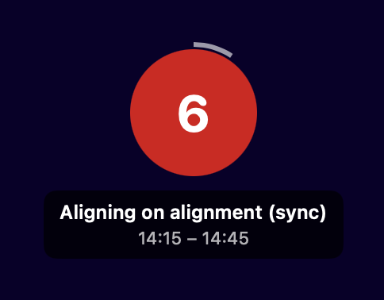

<p align="center">
  
</p>

<h1 align="center">Countdown</h1>

<p align="center">
  Never lose track of time.
</p>
<p align="center">
  A macOS menu bar app that floats a countdown circle on your screen showing minutes until your next Google Calendar event. The circle shifts from green to orange to red as the event approaches, and pulses when it's about to start.
</p>

<p align="center">
  
  
  
</p>

<p align="center">
  
  &nbsp;&nbsp;&nbsp;&nbsp;
  
</p>

## Features

- **Floating countdown circle** — always-on-top overlay you can drag anywhere on screen
- **Colour transitions** — green (60 min) → orange → red (imminent) → pulsing flash at <1 min
- **Multi-calendar support** — choose which Google Calendars to watch, with colour-coded indicators
- **Meetings filter** — optionally show only events with other attendees
- **Tap for details** — tap the circle to see event name and time range
- **Launch at login** — start automatically when you log in
- **Zero dependencies** — built entirely with native Swift, SwiftUI, and AppKit

## How It Works

The countdown circle appears automatically when a Google Calendar event is within 60 minutes. It fills up as the event approaches, changing colour to convey urgency at a glance. When the event is less than a minute away, the circle pulses to get your attention — tap it to acknowledge. The circle disappears 5 minutes after the event starts.

All controls live in the menu bar popover: connect your Google account, pick which calendars to track, toggle the meetings-only filter, and choose whether the circle is always visible or only before events.

## Setup

### Prerequisites

- macOS 14.0 (Sonoma) or later
- [Xcode](https://developer.apple.com/xcode/) with command-line tools
- [XcodeGen](https://github.com/yonaskolb/XcodeGen) — `brew install xcodegen`
- Google OAuth credentials (see below)

### Google OAuth Credentials

1. Go to the [Google Cloud Console](https://console.cloud.google.com/)
2. Create a project (or select an existing one)
3. Enable the **Google Calendar API**
4. Go to **Credentials** → **Create Credentials** → **OAuth client ID**
5. Choose **Desktop app** as the application type
6. Copy the **Client ID** and **Client Secret**

### Build & Run

```bash
git clone https://github.com/tavva/countdown.git
cd countdown

# Add your OAuth credentials
cp Countdown/Config.plist.template Countdown/Config.plist
# Edit Config.plist — fill in GOOGLE_CLIENT_ID and GOOGLE_CLIENT_SECRET

# Generate the Xcode project and build
xcodegen generate
xcodebuild -project Countdown.xcodeproj -scheme Countdown build
open DerivedData/Build/Products/Debug/Countdown.app
```

Or open `Countdown.xcodeproj` in Xcode and hit Run.

### First Launch

1. Click the circle icon in your menu bar
2. Click **Connect Google Account**
3. Authorise in your browser
4. The countdown circle appears when an event is within 60 minutes

## Development

The Xcode project is generated from `project.yml` using [XcodeGen](https://github.com/yonaskolb/XcodeGen). Edit `project.yml` for target or dependency changes, then run `xcodegen generate`.

### Running Tests

```bash
# All tests
xcodebuild -project Countdown.xcodeproj -scheme CountdownTests test

# Single test class
xcodebuild -project Countdown.xcodeproj -scheme CountdownTests \
  test -only-testing:CountdownTests/CountdownModelTests
```

Tests use the [Swift Testing](https://developer.apple.com/documentation/testing) framework (`@Test`, `#expect`), not XCTest.

### Architecture

```
Google Calendar API  ←  CalendarClient  ←  CalendarManager (60s polling)
                                                 ↓
                                           CountdownModel (1s state updates)
                                                 ↓
                                         CircleView + OverlayPanel
```

**CalendarManager** orchestrates everything: OAuth token refresh, calendar fetching, event filtering, and state updates. **CountdownModel** is a pure state machine — it computes visibility, colour progress, remaining time, and flash state from the current event list. **CircleView** renders the animated countdown, hosted in a floating **OverlayPanel** that stays on top of all windows.

Tokens are stored in the Keychain. User preferences (enabled calendars, overlay position, display options) are persisted in UserDefaults.

## Licence

[GPL v3](LICENCE)
